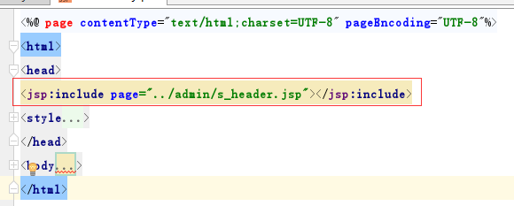
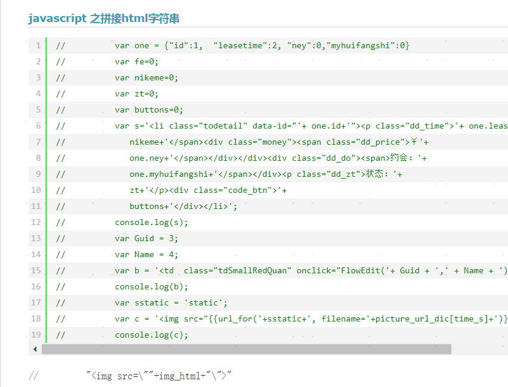
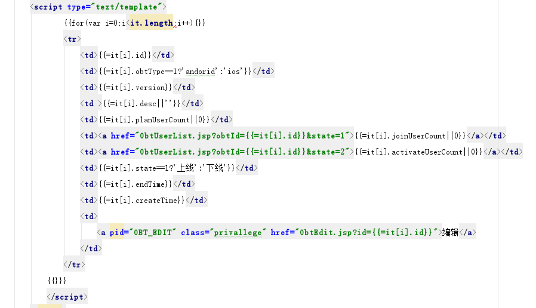
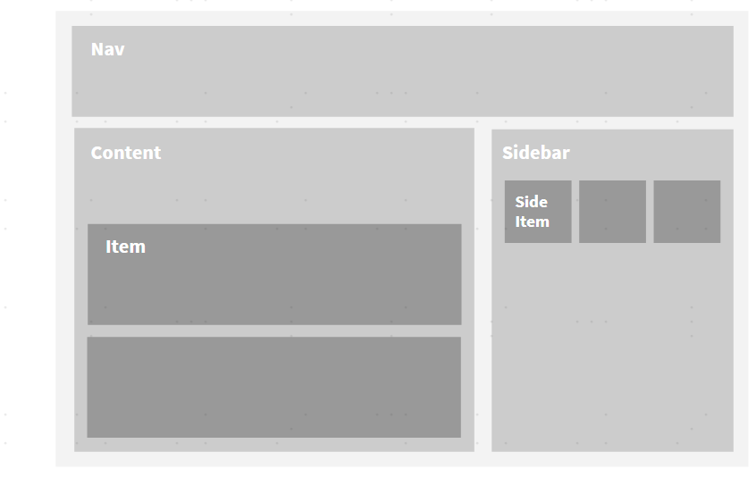
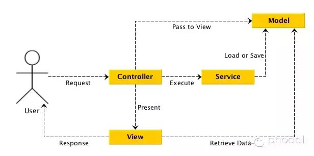

# WEB前端进化之路
## 1.1Web前端概述

广义web前端，包括移动前端（H5，微信，小程序，RN）以及PC前端，与网页有关的界面展示。通常运行于浏览器上。运行环境（webkit,V8）

狭义web前端: PC前端


## 1.2 包括什么？

技能清单：html+css+js(结构+表现+行为)

### 1.2.1 H5(基于webview，WKWebView，移动前端)。全名HTML5，用于网页结构编写。

移动 Web（web APP） 发展至 Hybrid App（混合开发，设计手机系统层次的东西找APP要）

### 1.2.2 PC前端（狭义web前端）

Admin后台管理页面，系统，需要考虑浏览器兼容性，一般不考虑页面适配（响应式布局）

### 1.2.3 小程序
微信小程序。轻量微型级APP

>H5与小程序（以下以微信小程序为例）区别：
 不同点：
 1.载体不同H5运行与浏览器环境。小程序运行与APP上

 2.交互方式 微信暴露方法，需要appId校验身份

 3.文件类型稍微不同：H5：HTML+CSS+JS  小程序：WXML、WXSS

 4.运行流畅度。小程序文件限制大小，集成各种插件。H5通常需要第三方插件，文件大小加载等需要优化

## 1.3 前端发展历程

相关技术的迭代更新：

HTML…HTML5

CSS-CSS3--sass

...ES5(2009)-ES6（ECMAScript2015）-ES7(ES：ECMASCRIPT一个规范，JAVASCRIPT是核心实现)

Ajax-fetch

http1.0-http1.1-http2.0

前端发展，到底解决了什么问题？

### 1.3.1 石器时代（进化之路1）

Java+jsp/ftl(freemarker),编译后才有HTML的影子



前端依附后台，基本没有技术选型之说。前后端不分离。前端写完页面和样式后台同学填字段……

### 1.3.2 刀耕火种时代（进化之路2）

前后端分离。jQuery的出现。前端可以有自己的处理方式。

大而全的框架jQuery： 兼容；选择器，DOM节点；ajax封装

#### 1.3.2.1样式，UI框架（jQuery UI ）： bootstrap（css框架）

#### 1.3.2.2 渲染HTML？


手拼html字符串--带来问题--- XSS攻击—-解决问题--转义字符串--挺恶心

于是又了五花八门的模板渲染引擎

mustache，ejs，doT.js



#### 1.3.2.3 jquery如何实现组件化？ 如何编写模块化代码？


jQuery+ bootstrap+require.js(browserify，sea.js )

seajs是执行时发现需要依赖模块再异步加载，requirejs异步加载定义依赖模块后再执行。

> require是运行时调用，所以require理论上可以运用在代码的任何地方
> import是编译时调用，所以必须放在文件开头（需要babel编译。浏览器才能使用）

require.js（案例）
链接： http://www.ruanyifeng.com/blog/2012/11/require_js.html

#### 1.3.3 总结：【jQuery时代】

兼容浏览器？ 反人类的IE？

缓存？渲染？组件化？模块化？文件压缩代码优化？
gulp案例

如此之折腾，能不能有一种解决方案，解决所有问题呢？

### 1.4.工业化时代
MVM,MVVM  数据驱动框架时代



View
负责界面和显示，不直接和Model交互

ViewModel
界面逻辑和模型数据封装，事件响应，指令，绑定的属性定义，（大部分方法VUE已经处理）。是view和model的桥梁，是对Model的抽象

Model
· 数据和业务逻辑
· 客户端领域模型


### 1.5 VUE ，React后起之秀

优点：

双向绑定(案例见下一页)，虚拟DOM节点，
模块端，组件化

开发效率高，学习成本低


#### 1.6 Vue双向绑定原理
双向绑定的做法：
```js
发布者-订阅者模式（backbone.js）
脏值检查（angular.js）  digest()
数据劫持（vue.js）通过Object.defineProperty()来劫持各个属性的setter，getter，在数据变动时发布消息给订阅者，触发相应的监听回调

new Vuex.Store({
  state,  //存放数据
  getters, // 过滤数据，转化数据。如果不使用，需要公用转化函数在mutation转化
  actions,
  mutations,
})
mapState
mapGetters ：将 store 中的 getter 映射到局部计算属性
mapActions
mapMutations
```

#### VUE思考：

 1.VUE项目如何去掉路由的‘#’？难看，iOS分享，微信下还会出现参数获取问题 。（见后一页）

 2.View层action怎么提交？不涉及持久化数据的交互，怎么写合适？
 （提交可以在组件中使用 this.$store.commit('xxx') 提交 mutation，或者使用 mapMutations 辅助函数将组件中的 methods 映射为 store.commit 调用（需要在根节点注入 store）。）

 3.如何理解双向绑定和单项数据流？


#### 1.7 react（简单说明）

 三大要点：
 Pros, state ,this.setState()  -- shouldComponentUpdate

 React是单向数据流，数据主要从父节点传递到子节点（通过props）


#### 思考
1.setState()函数是同步异步？

任务队列，不保证异步。通过回调函数解决……

## 1.8 服务端渲染 SSR

Nodejs（中转层）优缺点

事件驱动


## 1.9 技术选型，需要解决的问题

移动端
1. 运营活动，可复用性不强  jQuery+doT.js  canvas  animate
2. 复用性前，交互较多，  VUE， react...
3. 门户类，前后端不分离，用传统模式jQuery，兼容，或者考虑node中间层

PC端
1.复用，多人协作 。
Vue...+vue-bootstrap

2.需要兼容IE系列
avalon

