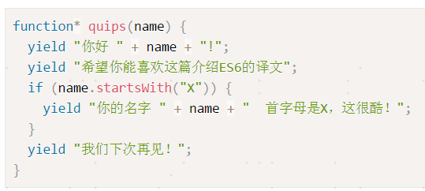
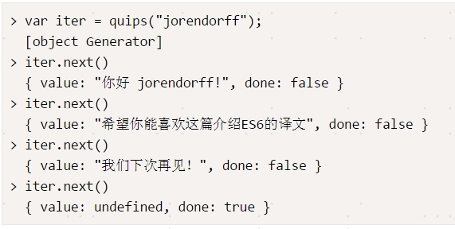
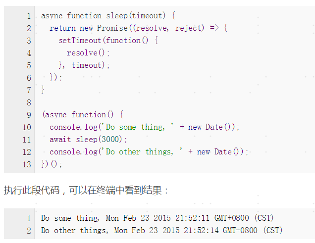
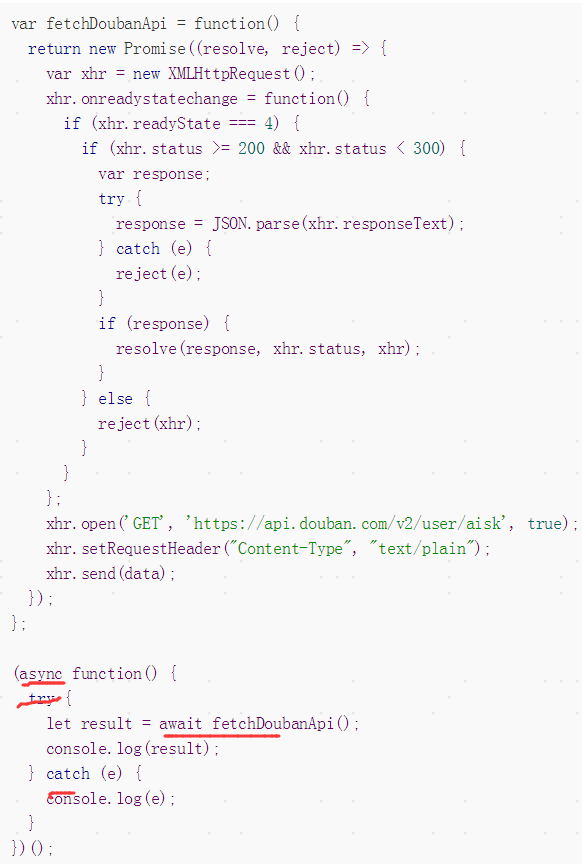

# 异步处理的几种方式
## 一.回调函数

## 二.发布 / 订阅者模式

```js
var pubsub = (function() {
        var q = {}
            topics = {},
            subUid = -1;
        //发布消息
        q.publish = function(topic, args) {
            if (!topics[topic]) {
                return;
            }
            var subs = topics[topic],
                len = subs.length;
            while (len--) {
                subs[len].func(topic, args);
            }
            return this;
        };
        //订阅事件
        q.subscribe = function(topic, func) {
            topics[topic] = topics[topic] ? topics[topic] : []; //允许订阅多次，只能订阅一次呢？
            var token = (++subUid).toString();
            topics[topic].push({
                token: token,
                func: func
            });
            return token;
        };
        q.remove = function(token, topic){
            var subs = topics[topic],
                len = subs.length;
            while (len--) {
               if( subs[len].token == token){
                console.log('删除订阅主题：'+topic);
                subs.splice(len,1)
               }
            }
        }
        return q;
    })();
    //触发的事件
    var f2 = function(topics, data) {
       console.log("logging:" + topics + ":" + data);
       console.log("this is function2");
    }
    var f3 = function(topics, data) {
       console.log("logging3:" + topics + ":" + data);
       console.log("this is function3");
    }
    function f1() {　
        setTimeout(function() {// f1的任务代码
　
            console.log("this is function1");
            //发布消息'done'
            pubsub.publish('done', 'hello world');　　　　
        }, 1000);
    }
    var fn = pubsub.subscribe('done', f2);
    pubsub.subscribe('done', f3);
    pubsub.subscribe('aa', f2);
    f1();
    pubsub.remove(fn,'done')
    ```
## 三.promise
```js
$.ajax("test.html")
    .done(function(){ alert("哈哈，成功了！"); })
    .fail(function(){ alert("出错啦！"); });
$.when($.ajax("test1.html"), $.ajax("test2.html"))
     .done(function(){ alert("哈哈，成功了！"); })
     .fail(function(){ alert("出错啦！"); });
function f1() {　　　　
    var dfd = $.Deferred();　　　　
    setTimeout(function() {　// f1的任务代码
       dfd.resolve();　　　　
    }, 500);　　　　
    return dfd.promise;
}
f1().then(f2).then(f3);

```
>  基本的 api
 1.	Promise.resolve()
 2.	Promise.reject()
 3.	Promise.prototype.then()
 4.	Promise.prototype.catch()
 5.	Promise.all() // 所有的完成

## 四.Generator(使用标志*/yield)(ES6)
```
Generator函数的概念：
yield 语句
Generator 函数可以暂停执行和恢复执行，这是它能封装异步任务的根本原因。
next 方法返回值的 value 属性，是 Generator 函数向外输出数据；next 方法还可以接受参数，这是向 Generator 函数体内输入数据。
协程：多个线程互相协作，完成异步任务。
Generator 函数是协程在 ES6 的实现。最大特点就是可以交出函数的执行权（即暂停执行）
-------------------------------
Koa 通过把一个中间件中的所有异步操作都 yield 出去，用 co 包来处理
```





## 五.async await(ES7,ES8?)



  await 命令后面的 Promise 对象，运行结果可能是 rejected，所以最好把 await 命令放在 try...catch 代码块中


