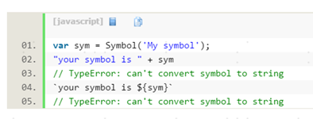
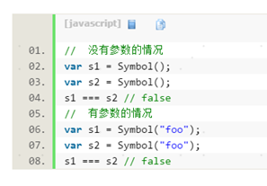
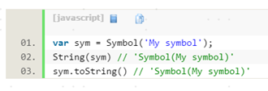

### 1.	Symbol
```
表示独一无二的值。它是 JavaScript 语言的第七种数据类型，前六种是： Undefined 、 Null 、布尔值（ Boolean ）、字符串（ String ）、数值（ Number ）、对象（ Object ）

Symbol函数前不能使用new命令，否则会报错
Symbol 值不能与其他类型的值进行运算，会报错
```



```
Symbol函数的参数只是表示对当前 Symbol 值的描述，因此相同参数的Symbol函数的返回值是不相等的
```


```
Symbol 值可以显式转为字符串。
```



### TCP协议中的三次握手和四次挥手
### 请求报头举例：
```
GET /form.html HTTP/1.1 (CRLF)
Accept:image/gif,image/x-xbitmap,image/jpeg,application/x-shockwave-flash,application/vnd.ms-excel,application/vnd.ms-powerpoint,application/msword,*/* (CRLF)
Accept-Language:zh-cn (CRLF)
Accept-Encoding:gzip,deflate (CRLF)
If-Modified-Since:Wed,05 Jan 2007 11:21:25 GMT (CRLF)
If-None-Match:W/"80b1a4c018f3c41:8317" (CRLF)
User-Agent:Mozilla/4.0(compatible;MSIE6.0;Windows NT 5.0) (CRLF)
Host:www.guet.edu.cn (CRLF)
Connection:Keep-Alive (CRLF)
```

### FormData对象，它可以更灵活方便的发送表单数据，因为可以独立于表单使用。
```
最大的好处是可以通过Ajax上传文件。通过这种方式，可以非常方便的进行表单提交，也不需要下文提到的那种方法了，直接表单转换成FormData对象即可。
var fd = new FormData(document.querySelector("form"));
fd.append("CustomField", "This is some extra data");
$.ajax({
  url: "stash.php",
  type: "POST",
  data: fd,
  processData: false,  // 不处理数据
  contentType: false   // 不设置内容类型
});

jquery的serializeArray方法（现在请使用FormData）
JQuery.param()方法：
var arr = $('#addForm').serializeArray();
$.param(arr);

"uname=alice&mobileIpt=110&birthday=1983-05-12"
```

```
encodeURI() 函数是不会进行转义的：;/?:@&=+$,#
也就是说encodeURI不编码字符有82个：!，#，$，&，'，(，)，*，+，,，-，.，/，:，;，=，?，@，_，~，0-9，a-z，A-Z

encodeURIComponent不编码字符有71个：!， '，(，)，*，-，.，_，~，0-9，a-z，A-Z

encodeURI和encodeURIComponent会把字符串编码成UTF-8的格式。
```


### 1.声明函数作用提升?声明变量和声明函数的提升有什么区别?
>(1) 变量声明提升：变量申明在进入执行上下文就完成了。
只要变量在代码中进行了声明，无论它在哪个位置上进行声明， js引擎都会将它的声明放在范围作用域的顶部；

>(2) 函数声明提升：执行代码之前会先读取函数声明，意味着可以把函数申明放在调用它的语句后面。
只要函数在代码中进行了声明，无论它在哪个位置上进行声明， js引擎都会将它的声明放在范围作用域的顶部；

>#### (3) 变量or函数声明：<font color='red'>函数声明会覆盖变量声明，但不会覆盖变量赋值。</font>
##### 同一个名称标识a，即有变量声明var a，又有函数声明function a() {}，不管二者声明的顺序，函数声明会覆盖变量声明，也就是说，此时a的值是声明的函数function a() {}。注意：如果在变量声明的同时初始化a，或是之后对a进行赋值，此时a的值变量的值。
eg:
```js
var a;
var c = 1;
a = 1;
function a() { return true; }
console.log(a);
```

### 2.window.onload ==? DOMContentLoaded ?

 >一般情况下，DOMContentLoaded事件要在window.onload之前执行，当DOM树构建完成的时候就会执行DOMContentLoaded事件，而window.onload是在页面载入完成的时候，才执行，这其中包括图片等元素。大多数时候我们只是想在DOM树构建完成后，绑定事件到元素，我们并不需要图片元素，加上有时候加载外域图片的速度非常缓慢。

### 3.$(function(){})和window.onload 和 $(document).ready(function(){})

 >window.onload:用于当页面的所有元素，包括外部引用文件，图片等都加载完毕时运行函数内的函数。<font color='red'>load方法只能执行一次</font>，如果在js文件里写了多个，只能执行最后一个。
 $(document).ready(function(){})和$(function(){})都是用于当页面的标准DOM元素被解析成DOM树后就执行内部函数。这个函数是可以在js文件里多次编写的，对于多人共同编写的js就有很大的优势，因为所有行为函数都会执行到。而且$(document).ready()函数在HMTL结构加载完后就可以执行，不需要等大型文件加载或者不存在的连接等耗时工作完成才执行，效率高。jQuery内部代码DOMContentLoaded

### 4.Array的 slice 和 concat 方法是浅拷贝，返回一个新数组
```js
var a = [[1,2,3],4,5];
var b = a.slice();
console.log(a === b);
a[0][0] = 6;
console.log(a);
console.log(b);
```
>JSON 对象的 parse 和 stringify

 JOSN 对象中的 stringify 可以把一个 js 对象序列化为一个 JSON 字符串，parse 可以把 JSON 字符串反序列化为一个 js 对象，这两个方法实现的是深拷贝。

### 5.将二维数组转化为一维, 将多维数组转化为一维
方法一:
```js
var flattened  = [[1,2],[3,4],[5,6]].reduce(function(a,b){
    return a.concat(b)
});
console.log(flattened);
```

方法二：
```js
const arr=[[1,2,3],[3,4],[5]];
console.log([].concat.apply([],arr));
```


### 6.array foreach和map的区别
Array.prototype.forEach()

为数组中的每个元素执行一次回调函数。 返回值：undefined

Array.prototype.map()

返回一个由回调函数的返回值组成的新数组。返回值：一个新数组，每个元素都是回调函数的结果。

没有办法终止或者跳出forEach()循环，除非抛出异常，所以想执行一个数组是否满足什么条件，返回布尔值，可以用一般的for循环实现，或者用Array.every()或者Array.some()

### 7.使用扩展运算符和initialValue绑定包含在对象数组中的数组
```js
var friends = [{
  name: 'Anna',
  books: ['Bible', 'Harry Potter'],
  age: 21
}, {
  name: 'Bob',
  books: ['War and peace', 'Romeo and Juliet'],
  age: 26
}];
var allBooks = friends.reduce(function(prev, cur){
    return [...prev, ...cur.books]
}, ['Alice'])
console.log(allBooks);
```

### 8 typeof(NaN)和typeof(Infinity)都返回number 。NaN参与任何数值计算的结构都是NaN，而且 NaN != NaN

### 在 Chrome 浏览器的 Elements 里面选中某个元素，按 h 可以隐藏该元素。在 Chrome 的 Sources 里面的里面，ctrl + o 可以打开某个 JS 脚本，并且可以直接修改它，修改的内容在不刷新的情况下是生效的。


### a,b交换值,不使用变量：
```js
var a=1,b=2;a=[b,b=a][0]
```

```js
var a = 1,b=2;
a = a ^ b;
b = a ^ b;
a = a ^ b;
console.log(a);
console.log(b)
```


### BFC(Block Formatting Context)是Web页面中盒模型布局的CSS渲染模式。它的定位体系属于常规文档流著作权归作者所有。一个BFC是一个HTML盒子并且至少满足下列条件中的任何一个：

   float的值不为none

   position的值不为static或者relative

   display的值为 table-cell, table-caption, inline-block, flex, 或者 inline-flex中的其中一个

   overflow的值不为visible

### bfc用途：
>
1. 使用BFC来防止外边距折叠
2. 使用BFC来防止文字环绕
3. 使用BFC来包含浮动（父容器因为浮动，不会有任何的高度，使用BFC如overflow:hidden）

### BFC布局规则：
>
* 内部的Box会在垂直方向，一个接一个地放置。
* Box垂直方向的距离由margin决定。属于同一个BFC的两个相邻Box的margin会发生重叠
* 每个元素的margin box的左边， 与包含块border box的左边相接触(对于从左往右的格式化，否则相反)。即使存在浮动也是如此。
* BFC的区域不会与float box重叠。
* BFC就是页面上的一个隔离的独立容器，容器里面的子元素不会影响到外面的元素。反之也如此。
* 计算BFC的高度时，浮动元素也参与计算


### 9 webpack
>为什要使用WebPack
高度可配置的模块打包器(module bundler)

核心概念：
入口(entry)

输出(output)

loader: loader 让 webpack 能够去处理那些非 JavaScript 文件（webpack 自身只理解 JavaScript）
插件(plugins)

> webpack 组件按需加载 import() 和 require.ensure()
```js
require.ensure(['echarts'], function() {
    var echarts = require('echarts');
    /* ... */
});
```

CommonsChunkPlugin提取所有的公共模块  分离CSS  ExtractTextWebpackPlugin 帮助你将 CSS 单独打包，


### 10 一个shim是一个库,它将一个新的API引入到一个旧的环境中,而且仅靠旧环境中已有的手段实现
      一个polyfill就是一个用在浏览器API上的shim.我们通常的做法是先检查当前浏览器是否支持某个API,如果不支持的话就加载对应的polyfill.
      然后新旧浏览器就都可以使用这个API了.术语polyfill来自于一个家装产品Polyfilla:

> shim 是将不同 api 封装成一种，比如 jQuery 的 $.ajax 封装了 XMLHttpRequest 和 IE 用 ActiveXObject 方式创建 xhr 对象；polyfill 特指 shim 成的 api 是遵循标准的，其典型做法是在IE浏览器中增加 window.XMLHttpRequest ，内部实现使用 ActiveXObject。


### 11
{}==0：VM339:1 Uncaught SyntaxError: Unexpected token ==

0=={}：false

''=={}：false

+undefined ：NaN

0==[]：true

''==[]：true

0==undefined：false

''==undefined: false

"" == "0" // false

0 == "" // true

0 == "0" // true

false == "0" // true

[1,2] =='1,2';//true

内部调用Object原型上的valueOf();
null是一个表示"无"的对象，转为数值时为0；undefined是一个表示"无"的原始值，转为数值时为NaN

Number(null)
// 0

5 + null
// 5

Number(undefined)
// NaN

5 + undefined
// NaN

--------------------
优先级从高到低排列：
typeof 是操作符，+-*/ 是运算符。typeof 有更高的优先级。
圆括号()  >  typeof运算符   >   除法/

1. typeof 1/0; //NaN
2. typeof typeof 1/0; //NaN
3. typeof(1/0); //"number"
4. typeof typeof(1/0); //"string"
5. typeof(typeof 1/0); //"number"

>JS中{}+[]和[]+{}的返回值情况是怎样的？

[]+{}:
调用其 valueOf() 或 toString()以取得一个非对象的值。如果两个值中的任何一个是字符串，则进行字符串串接，否则进行数字加法。

先调用valueOf,返回本身，继续调用toString(),[] toString返回''
'object Object'+'' = 'object Object'

{}+[]:
{} 被解析为空的 block，随后的 + 被解析为正号运算符。即实际上成了：
{ // empty block }
+[]

 +[]=0


