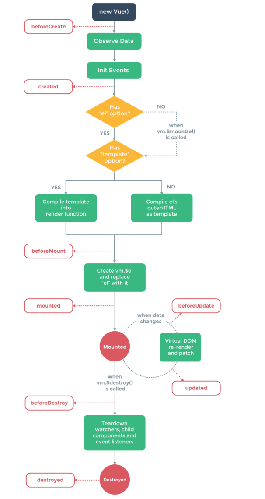
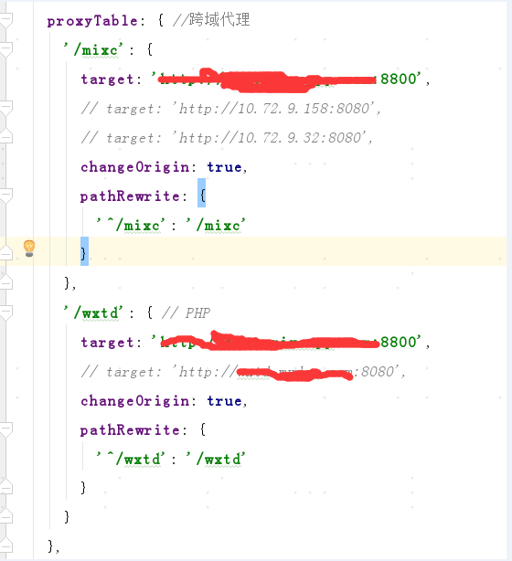
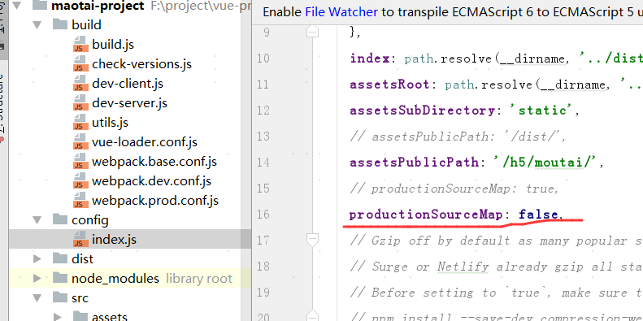
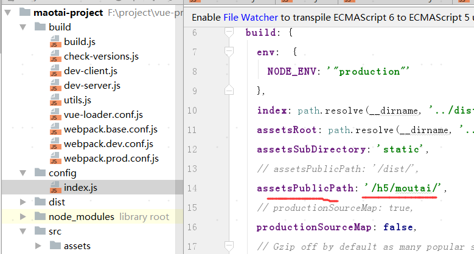

# vue项目总结及其使用的技术链
## 1.Vue-cli：
> 集成的框架。注意点：更改vue-cli相关配置信息，最好重启npm run dev，因为有时页面不刷新

## 2.Vue2.0 框架。
> 注意vue生命周期



## 3.Vue-router：
路由，注意$router与$route区别，用法：

> this.$router.push({‘/aa’})：跳转至路由aa下

> this.$route.query.mallNo：获取URL中的查询参数mallNo

## 4.Fastclick：
移动端用fastclick处理click时延

## 5.mint-ui：
基于vue2.0的前端框架 mint-ui

## 6.vuex：
专为 Vue.js 应用程序开发的状态管理模式。采用集中式存储管理应用的所有组件的状态，并以相应的规则保证状态以一种可预测的方式发生变化。
谷歌浏览器用使用官方调试工具 devtools extension

> Ps.不使用vuex组件间如何通讯？见“关于Vue的思考题”

## 7.axios:
http请求

promise： 异步回调处理（使用es6-promise中间件）

## 8.Rem：
css适配

## 9.SASS：
css模块化


# 跨域处理
## 1.开发环境
http-proxy-middleware中间件 ，代理proxyTable




## 2.生产环境
nginx

# http请求：
## 1.可以使用原生XMLHTTPRequst也可以使用fetch,vue-resource(官方已经停止更新，推荐axios)
axios配合promise处理异步请求

环境切换：

开发，测试环境，生产环境的切换。

一方面：

>webpack打包，环境判断process.env.NODE_ENV

另一方面：

>根据URL hostName动态判断当前环境并赋值，如：
```js
if(hostName =='app.emixcapp.com'){
    ApiUrl = 'https://app.emixcapp.com'
}else if(hostName =='test.emixcapp.com'&&port=='8001'){
    ApiUrl ='http://test.emixcapp.com:8001'
}else if(hostName =='uat.emixcapp.com'){
    ApiUrl='http://uat.emixcapp.com'
}else if(hostName =='test.emixcapp.com'&&port=='8800'){
    ApiUrl ='http://test.emixcapp.com:8800'
}
```


# webpack配置注意
## 1.开发环境：

// cheap-module-eval-source-map is faster for development

// devtool: '#cheap-module-eval-source-map',

devtool: '#source-map',

>使用'#cheap-module-eval-source-map'谷歌浏览器断点调试有问题，改为后者即可

## 2.生产环境：


productionSourceMap: false时，浏览器不会有webpack的调试map文件，只有压缩的dist目录

打开目录：



assetsPublicPath 必须与线上目录一致，否则css,js无法找到

# 目录结构及代码分层处理
>引入vuex状态管理，在view层触发请求按钮，通过action层统一处理所有异步请求，状态更改通过commit触发mutation的state修改。通过state的更改驱动view层UI更改。如需action层异步回调后做其他处理，请在回调内处理
如果不适用vuex，则无需这么复杂。页面请求，ajax返回函数里直接处理即可，无需考虑state（适用于小型项目，但需要处理好组件之间的通信）


