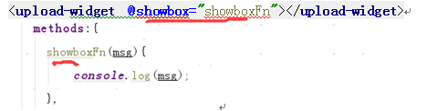
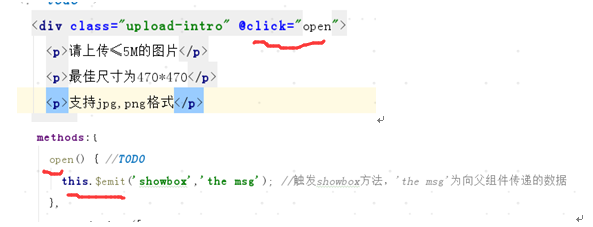
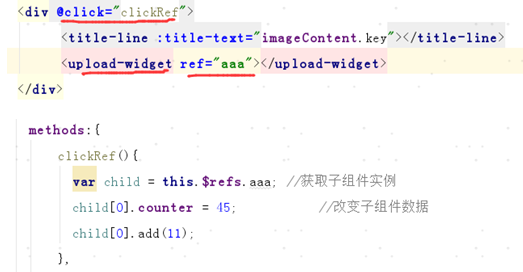
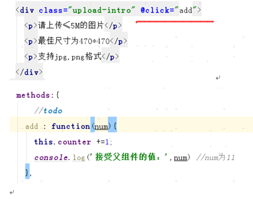

## vue的一些问题收集

### 1.什么时候适合用methods，什么时候适合用computed，什么时候适合用watch
methods是个方法，比如你点击事件要执行一个方法，这时候就用methods(传递参数的话也使用methods)

computed是计算属性，实时响应的（计算属性默认只有getter，可以在需要的时候自己设定setter）

computed比较适合一个属性受多个属性影响的情形

可以将同一函数定义为一个 method 而不是一个计算属性。对于最终的结果，两种方式确实是相同的。然而，
不同的是计算属性是基于它们的依赖进行缓存的。计算属性只有在它的相关依赖发生改变时才会重新求值。
这就意味着只要 message 还没有发生改变，多次访问 reversedMessage 计算属性会立即返回之前的计算结果，<font color="red">而不必再次执行函数</font>

watch:
watch和computed很相似，watch用于观察和监听页面上的vue实例，当然在大部分情况下我们都会使用computed，但如果要在<font color="red">数据变化的同时进行异步操作或者是比较大的开销</font>，那么watch为最佳选择

watch为一个对象，键是需要观察的表达式，值是对应回调函数。值也可以是方法名，或者包含选项的对象


### 2.各组件如何通信（父传子，子传父，同级组件）
vuex

$emit $on

#### 2.1子调用父例子：

//父组件



//子组件



#### 2.2 父组件调用子组件
//父组件



//子组件



#### 2.3.子组件与子组件通信


### 3.公用方法mixin处理，全局状态该如何存储，如何自定义组件的指令

### 4.vue-cli脚手架了，vue是如何通过使用webpack进行测试和生产环境进行一个构建处理的


### 5 数据筛选 computed（）
```js
1.<li v-for="n in evenNumbers">{{ n }}</li>

data: {
  numbers: [ 1, 2, 3, 4, 5 ]
},
computed: {
  evenNumbers: function () {
    return this.numbers.filter(function (number) {
      return number % 2 === 0
    })
  }
}
```
```js
2.
<li v-for="n in even(numbers)">{{ n }}</li>
data: {
  numbers: [ 1, 2, 3, 4, 5 ]
},
methods: {
  even: function (numbers) {
    return numbers.filter(function (number) {
      return number % 2 === 0
    })
  }
}
```

## 6 vuex
使用场景：

多个视图依赖于同一状态。

来自不同视图的行为需要变更同一状态。

```js
Vuex 是一个专为 Vue.js 应用程序开发的状态管理模式
mapState 辅助函数

import {mapState, mapActions} from 'vuex'
当一个组件需要获取多个状态时候，将这些状态都声明为计算属性会有些重复和冗余。
为了解决这个问题，我们可以使用 mapState 辅助函数帮助我们生成计算属性

Getters
mapGetters辅助函数仅仅是将store中的getters映射到局部计算属性中，用法和mapState类似Getters

更改 Vuex 的 store 中的状态的唯一方法是提交 mutation：
这个mutation都有一个字符串的 事件类型 (type)和一个 回调函数 (handler)。这个回调函数就是我们实际进行状态更改的地方，并且它会接受 state 作为第一个参数：

Action 类似于 mutation，不同在于：
1.Action 提交的是 mutation，而不是直接变更状态。
2.Action 可以包含任意异步操作。

```


### 7
```
1.var data = {
	a:1
}
//共享了同一个 data ， 因此增加一个 counter 会影响所有组件！
data:function(){
	return data
}

//返回全新的 data 对象来解决这个问题
2.data:function(){
	return {
		a:1
	}
}
//vue中data 是一个例外，它必须是函数
```

### 8
```
Vue webpack项目无法在控制台 devTool下断点调试
查找webpack配置,找到devtool
devtool: options.dev ? '#eval-source-map' : '#source-map'
把 #eval-source-map 改成 #source-map 就好了
```

### 9. vue文件中style的scoped属性

scoped可以实现style只作用于当前的.vue文件

```
<div data-v-53795c54 class="user"></div>
css样式是这样的

.user[data-v-53795c54] {
    color:#333;
}
```

### 10. Vue.nextTick用法
```
用法：在下次 DOM 更新循环结束之后执行延迟回调。在修改数据之后立即使用这个方法，获取更新后的 DOM。
应用场景：需要在视图更新之后，基于新的视图进行操作
在 created 和 mounted 阶段，如果需要操作渲染后的试图，也要使用 nextTick 方法

```

### 11. vue如何使用filter过滤器
```js
Vue.filter('capitalize', function (value) {
  if (!value) return ''
  value = value.toString()
  return value.charAt(0).toUpperCase() + value.slice(1)
```
### 12. keep-alive使用

### 13. 组件slot
```
组件模板之中的内容分发插槽
有 name 特性的 slot 称为具名 slot。 有 slot 特性的内容将分发到名字相匹配的具名 slot
作用域插槽是一种特殊类型的插槽，用作使用一个 (能够传递数据到) 可重用模板替换已渲染元素。

父组件通过slot-scope就可以拿到子组件slot上绑定的值，并且2.5.0版本可以用于任意元素上

1.匿名slot使用
//定义组件my-component
<div class="myComponent">
  <slot></slot>
</div>
//使用方法
<my-component>
  <p>我就是slot的替代内容，这里可以放任何标签元素，即使是一长串ul>li列表</p>
</my-component>

2.具名slot使用

//定义组件my-component
<div class="myComponent">
  <slot name="mySlot"></slot>
</div>
//使用方法
<my-component>
  <p slot="mySlot">我就是这个叫mySlot的slot替代内容，这里可以放任何标签元素，即使是一长串ul>li列表，但是我是一个有名字的宝宝，所以你必须给我加上slot="mySlot"，不然我就报错给你看！</p>
</my-component>
```

### 在vue中使用import()来代替require.ensure()实现代码打包分离
```
例：require.ensure()实现
const notFound = r => require.ensure([], () => r(require('@views/common/404')), 'index')

例：import()实现
const notFound = () => import(/* webpackChunkName: "index" */ '@views/common/404')
```

```
require.ensure()
https://react-guide.github.io/react-router-cn/docs/guides/advanced/DynamicRouting.html

```

### mixins使用
```
混入 (mixins) 是一种分发 Vue 组件中可复用功能的非常灵活的方式。
混入对象可以包含任意组件选项。当组件使用混入对象时，所有混入对象的选项将被混入该组件本身的选项。

和组件的数据发生冲突时以组件数据优先。


全局混入
// 为自定义的选项 'myOption' 注入一个处理器。
Vue.mixin({
  created: function () {
    var myOption = this.$options.myOption
    if (myOption) {
      console.log(myOption)
    }
  }
})

new Vue({
  myOption: 'hello!'
})
// => "hello!"
```


